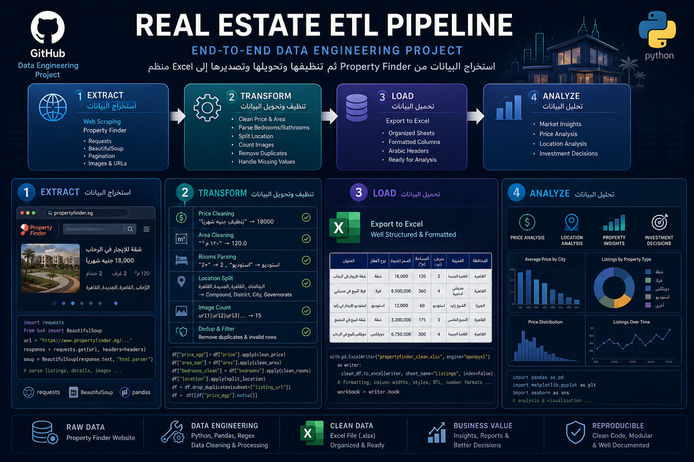
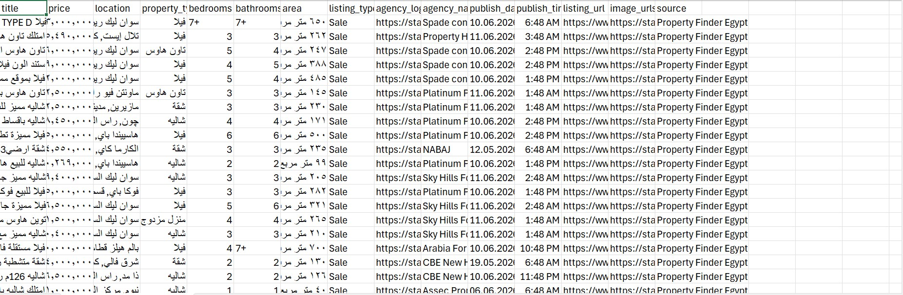
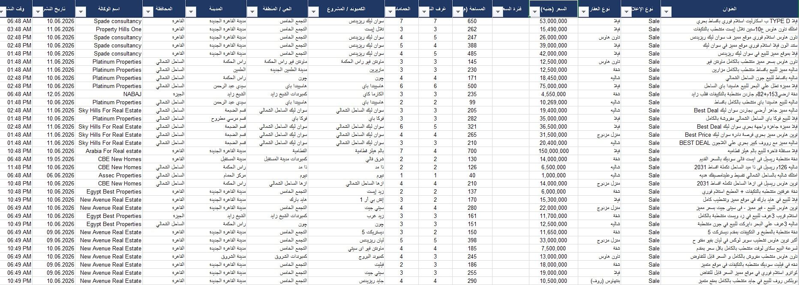
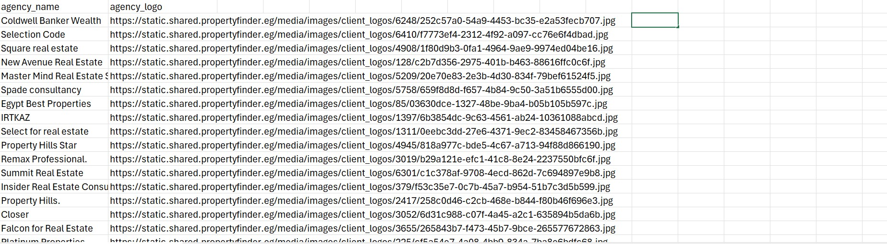

<div align="center">



# 🏠 Property Finder Egypt — Real Estate ETL Pipeline

**End-to-End Data Engineering Project**

استخراج البيانات من Property Finder Egypt ثم تنظيفها وتصديرها إلى Excel منظم

[](https://python.org)
[](https://selenium.dev)
[](https://pandas.pydata.org)
[](https://openpyxl.readthedocs.io)
[](https://jupyter.org)

</div>

---

## 📋 Table of Contents

- [Project Overview](#-project-overview)
- [Pipeline Architecture](#-pipeline-architecture)
- [Data Collected](#-data-collected)
- [Project Structure](#-project-structure)
- [Setup & Installation](#-setup--installation)
- [How to Run](#-how-to-run)
- [Output Sample](#-output-sample)
- [Tech Stack](#-tech-stack)
- [Author](#-author)

---

## 🎯 Project Overview

This project builds a complete **ETL (Extract → Transform → Load)** pipeline for real estate listings in Egypt.

It scrapes thousands of property listings directly from **propertyfinder.eg**, cleans and structures the raw Arabic data, and exports a professionally formatted **Excel file** ready for analysis or business use.

| Stage | What Happens |
|---|---|
| **1 — Extract** | Selenium scrapes Sale & Rent listings + 809 agencies across 50+ pages |
| **2 — Transform** | Clean prices, parse Arabic numerals, split locations, count images, remove duplicates |
| **3 — Load** | Export to a structured `.xlsx` with 4 sheets and Arabic RTL formatting |
| **4 — Analyze** | Ready for price analysis, location insights, and investment decisions |

---

## 🏗️ Pipeline Architecture

```
propertyfinder.eg
        │
        ▼
┌───────────────────┐
│   1. EXTRACT      │  Selenium + BeautifulSoup + Requests
│  Web Scraping     │  • Sale listings (up to 50 pages)
│                   │  • Rent listings (up to 50 pages)
│                   │  • 809 agencies + logos
└────────┬──────────┘
         │  raw CSV  (Arabic text, mixed formats)
         ▼
┌───────────────────┐
│   2. TRANSFORM    │  Pandas + Regex
│  Data Cleaning    │  • Arabic → Western digits  ٥٣٬٠٠٠ → 53000
│                   │  • Price extraction (strip جنيه / شهرياً)
│                   │  • Area extraction (strip متر مربع)
│                   │  • Rooms parsing  7+ → 7, استوديو kept
│                   │  • Location split → 4 columns
│                   │  • Image URL count
│                   │  • Dedup on listing_url
└────────┬──────────┘
         │  clean DataFrame
         ▼
┌───────────────────┐
│   3. LOAD         │  OpenPyXL
│  Excel Export     │  • Sheet 1: All data (2,500+ rows)
│                   │  • Sheet 2: Summary Dashboard
│                   │  • Sheet 3: Sale listings only
│                   │  • Sheet 4: Rent listings only
└────────┬──────────┘
         │
         ▼
   📊 propertyfinder_cleaned.xlsx
```

---

## 📦 Data Collected

### Per Listing (20 columns)
| Column | Description | Example |
|---|---|---|
| `title` | Listing title | فيلا لبيع في سوان ليك |
| `listing_type` | Sale or Rent | Sale |
| `property_type` | Type of property | فيلا / شقة / شاليه |
| `price_egp` | Clean price (integer) | 53,000,000 |
| `price_period` | Rent period | شهري / None |
| `area_sqm` | Area in m² (float) | 650.0 |
| `bedrooms_clean` | Bedroom count | 4 |
| `bathrooms_clean` | Bathroom count | 3 |
| `compound` | Compound / project name | سوان ليك ريزيدنس |
| `district` | District / neighbourhood | التجمع الخامس |
| `city` | City | مدينة القاهرة الجديدة |
| `governorate` | Governorate | القاهرة |
| `agency_name` | Agency responsible | Spade consultancy |
| `publish_date` | Date published | 10.06.2026 |
| `publish_time` | Time published | 6:48 AM |
| `image_count` | Number of listing images | 15 |
| `listing_url` | Direct URL to listing | https://... |

### Agencies Dataset
- **809 unique agencies** with name + logo URL
- Saved separately as `propertyfinder_agencies.csv`

---

## 📁 Project Structure

```
propertyfinder-etl/
│
├── 📓 propertyfinder_scraper_v2.ipynb   # Main notebook (all cells)
│     ├── Cell 1  — Install dependencies
│     ├── Cell 2  — Imports
│     ├── Cell 3  — Shared helper: get_driver()
│     ├── Cell 4a — Scrape Agencies (41 pages)
│     ├── Cell 4  — Scrape Sale Listings (50 pages)
│     ├── Cell 5  — Scrape Rent Listings (50 pages)
│     ├── Cell 6  — Merge & save to CSV
│     └── Cell 7  — Clean & export to Excel ✨
│
├── 📄 cell_7_cleaning.py                # Standalone cleaning script
│
├── 📊 propertyfinder_cleaned.xlsx       # Final output (sample)
├── 📋 propertyfinder_agencies.csv       # 809 agencies dataset (sample)
│
└── images/
      ├── wallpaper.png                  # ETL pipeline diagram
      ├── before_cleaning.jpg            # Raw data screenshot
      ├── cleaned_data.jpg               # Clean Excel screenshot
      └── agencies.jpg                   # Agencies dataset screenshot
```

---

## ⚙️ Setup & Installation

### Prerequisites
- Python 3.10+
- Google Chrome installed
- Jupyter Notebook or JupyterLab

### Install dependencies

```bash
pip install selenium pandas openpyxl webdriver-manager pytz requests beautifulsoup4
```

Or run **Cell 1** in the notebook:

```python
!pip install -q selenium pandas webdriver-manager pytz
```

---

## 🚀 How to Run

### Option A — Full Pipeline (Notebook)

1. Open `propertyfinder_scraper_v2.ipynb` in Jupyter
2. Run cells **in order** from Cell 1 to Cell 7
3. Output: `propertyfinder_cleaned.xlsx` in the same folder

> **Note:** Scraping 50 pages × 2 (Sale + Rent) takes ~15–25 minutes depending on your internet speed.

### Option B — Cleaning Only (if you already have the CSV)

```bash
python cell_7_cleaning.py
```

Make sure `propertyfinder_properties.csv` is in the same directory.

### Configurable Settings

In the scraper cells, you can adjust:

```python
MAX_PAGES = 50          # Number of pages to scrape per listing type
AGENCY_MAX_PAGES = 41   # Number of agency pages
```

---

## 📸 Output Sample

### Raw Data (Before Cleaning)


### Final Excel Output (After Cleaning)


### Agencies Dataset


---

## 🛠️ Tech Stack

| Tool | Purpose |
|---|---|
| **Selenium** | Browser automation & JavaScript rendering |
| **BeautifulSoup** | HTML parsing |
| **Pandas** | Data manipulation & cleaning |
| **Regex** | Arabic text parsing & number extraction |
| **OpenPyXL** | Excel file generation with RTL formatting |
| **pytz** | Cairo timezone handling for publish dates |
| **webdriver-manager** | Auto ChromeDriver management |

---

## 👤 Author

**Eng. Elsayed Bakry**

> Built as a real-world Data Engineering project demonstrating web scraping, ETL pipeline design, and Arabic data processing.

---

<div align="center">

⭐ If you found this useful, give it a star!

</div>
